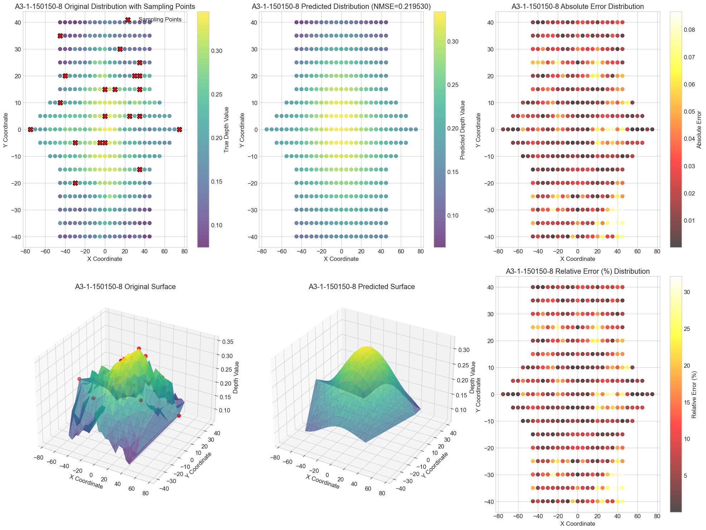

# Gaussian Process Regression for Lightning-induced Damage Depth Prediction(Supplemental information of the paper entitled "Prediction of Residual Stiffness of CFRP Laminate after Lightning Strike: A Novel Hardness-Based Approach")

This project employs Gaussian Process Regression (GPR) to predict lightning-induced damage depth in composite plates based on hardness measurement data. The model establishes a probabilistic relationship between hardness variations and the spatial distribution of lightning strike damage, enabling accurate damege depth estimation.
## Features

- Complete GPR pipeline from raw data to predictions
- Advanced data preprocessing and transformation
- Multiple visualization methods:
  - 2D scatter plots
  - 3D surface plots
  - Heatmaps
- Hyperparameter optimization using dual annealing
- Model evaluation with normalized mean squared error (NMSE)

## Data Format
Input data should be in Excel format with sheets for each sample containing:
- X/Y coordinates in first row/column
- Hardness values (in percentage) in matrix format

Example of data structure:
<pre>
       X1    X2    X3
Y1   0.96  0.92  0.96
Y2   0.94  0.90  0.92
</pre>

## Methodology
### Data Transformation:
- Hardness values converted using(Eq-7):  
  `δ = 0.67*exp(-H/0.11) - 1.49e-5*exp(H/0.10) + 0.33`
- Min-max normalization

### Model Architecture:
- Gaussian Process with RBF kernel
- Optimized using dual annealing

### Evaluation:
- Normalized Mean Squared Error (NMSE)
- Visual inspection of predictions

## Visualization
The notebook includes:
- Raw data distribution plots
- 3D surface plots of hardness patterns
- Comparison between actual and predicted values
- Error analysis visualizations

## Results
Key performance metrics:
- NMSE: [Your NMSE Value]
- Mean Absolute Error : [Your Mean Absolute Error]

Sample prediction visualization:  

