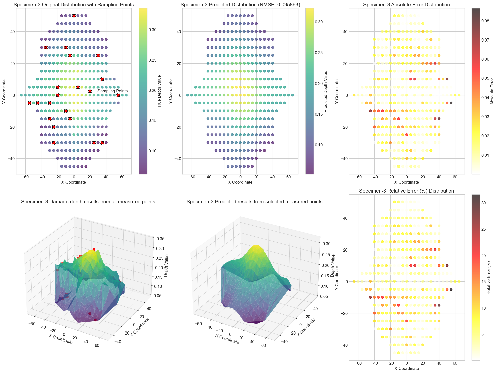

# Gaussian Process Regression for Material Hardness Prediction

This project implements Gaussian Process Regression (GPR) to predict hardness distribution patterns across steel plates using experimental measurement data.

## Features

- Complete GPR pipeline from raw data to predictions
- Advanced data preprocessing and transformation
- Multiple visualization methods:
  - 2D scatter plots
  - 3D surface plots
  - Heatmaps
- Hyperparameter optimization using dual annealing
- Model evaluation with mean squared error (MSE)

## Data Format
Input data should be in Excel format with sheets for each plate containing:
- X/Y coordinates in first row/column
- Hardness values (in percentage) in matrix format

Example structure:
   X1    X2    X3
Y1 0.23 0.25 0.27
Y2 0.24 0.26 0.28

## Methodology
### Data Transformation:
- Hardness values converted using:  
  `δ = 0.67*exp(-H/0.11) - 1.49e-5*exp(H/0.10) + 0.33`
- Min-max normalization

### Model Architecture:
- Gaussian Process with RBF kernel
- Optimized using dual annealing

### Evaluation:
- Mean Squared Error (MSE)
- Visual inspection of predictions

## Visualization
The notebook includes:
- Raw data distribution plots
- 3D surface plots of hardness patterns
- Comparison between actual and predicted values
- Error analysis visualizations

## Results
Key performance metrics:
- MSE: [Your MSE Value]
- Training time: [Your Training Time]

Sample prediction visualization:  

